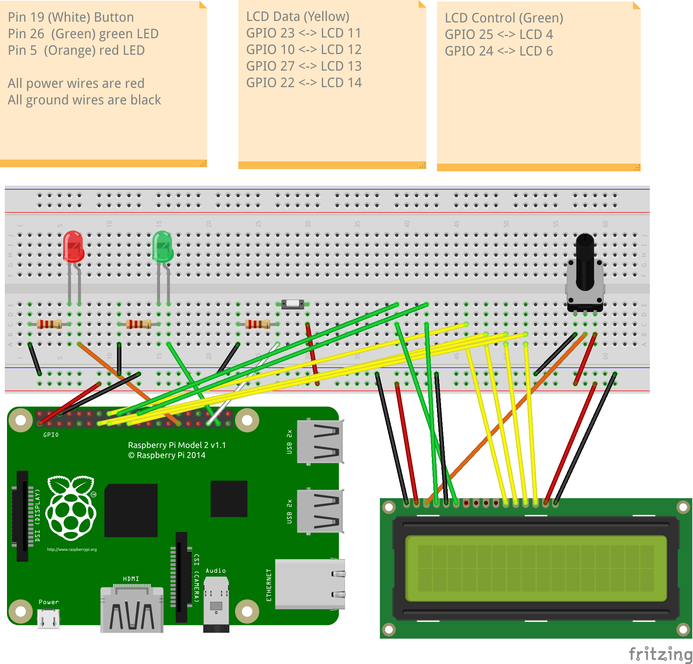

# MasterMind on Raspberry Pi (C + ARM Assembler)

A hardware implementation of the Mastermind guessing game, built in C with core logic ported to ARM Assembler, running on a Raspberry Pi with physical LED, button, and LCD I/O.

## Overview

This project implements Mastermind as an embedded systems application rather than a purely software game. The player enters guesses using a physical push button, timed input is automatically recorded after a 3-second pause, and the result is shown on an LCD display, with LEDs used to encode feedback (green for exact matches, red as a separator and status indicator). Low-level hardware control (GPIO pin mode, digital writes, button reads) is implemented using **inline ARM Assembler**, and the core sequence-matching logic is implemented as a **standalone ARM Assembler function**, validated against an equivalent C implementation for correctness and performance.

## How the Game Works

1. On startup, the LCD displays a welcome message and player surname, and the LEDs blink once per letter, green for vowels, red for consonants.
2. A secret sequence of 3 numbers (1–3) is generated at random.
3. The player enters their guess by pressing the button a number of times per digit. After 3 seconds of no further presses, that digit is recorded and the next one begins.
4. Once all 3 digits are entered, the guess is scored against the secret sequence for exact and approximate matches.
5. Feedback is given both on the LCD ("Exact: X", "Approx: Y") and via LED blinks (green for exact, red as a separator, then green for approximate).
6. The game repeats until the full secret sequence is guessed correctly, at which point the LCD displays "SUCCESS" along with the number of attempts taken.

## Features

- Full Mastermind game logic: random secret sequence generation, timed button-based guess input, exact/approximate match scoring
- Physical I/O: button input for guesses, dual LED output for status and feedback, LCD display for live game state
- Debounced button presses with a timer-based (SIGALRM) input cut-off instead of fixed polling
- Low-level GPIO control written in inline ARM Assembler (`digitalWrite`, `pinMode`, `readButton`)
- Core matching algorithm implemented in standalone ARM Assembler (`mm-matches.s`)
- C vs. Assembler correctness and performance testing via a dedicated test harness (`testm.c`)
- Automated unit testing via shell script, covering exact/approximate match edge cases
- Command-line options for verbose/debug output and direct unit testing (`-v`, `-d`, `-u`, `-s`)

## Tech Stack

- **Language:** C, ARM Assembler (inline and standalone)
- **Hardware:** Raspberry Pi (Model 2), LEDs, push button, 16x2 LCD display, potentiometer
- **Tooling:** GCC, GNU Make, Bash

## Hardware Setup

| Component | Connection |
|---|---|
| Green LED | GPIO 26 |
| Red LED | GPIO 5 |
| Button | GPIO 19 |
| LCD Data | GPIO 23, 10, 27, 22 to LCD pins 11, 12, 13, 14 |
| LCD Control | GPIO 25, 24 to LCD pins 4, 6 |

Power wires are red, ground wires are black. A potentiometer controls LCD contrast. Full wiring is shown in the Fritzing diagram below.

## Project Structure

    master-mind/
    |-- master-mind.c        Main game logic, GPIO/LCD setup, timer-based input handling
    |-- lcdBinary.c           Inline ARM Assembler: GPIO pin mode, digital write, button read
    |-- mm-matches.s          Standalone ARM Assembler: exact/approximate match scoring
    |-- testm.c               Test harness comparing C and Assembler match implementations
    |-- test.sh               Shell script for automated unit testing of match scoring
    |-- Makefile
    `-- fritz_CW2_2025_bb.png

## Building and Running

Build the main program and test harness:

    make all

Run the game in debug mode:

    make run

Run automated unit tests on the matching function:

    make unit

Compare the C and Assembler implementations of the matching function directly:

    make test

### Manual Unit Testing

    ./cw2 -u 121 313

Output:

    0 exact matches
    1 approximate matches

General command-line format:

    ./cw2 [-v] [-d] [-s] <secret sequence> [-u <sequence1> <sequence2>]

- `-v` verbose output
- `-d` debug output
- `-s <seq>` set the secret sequence
- `-u <seq1> <seq2>` run a one-off match comparison between two sequences

Automated test suite:

    sh ./test.sh
    echo $?   # 0 if all tests passed

## How the Matching Logic Works

The core of the game, scoring a guess against the secret sequence, is implemented twice: once in C (`countMatches`, in `master-mind.c`) and once in ARM Assembler (`mm-matches.s`). `testm.c` runs both implementations against randomised and manually specified sequence pairs, timing each and confirming their outputs agree, which validates both correctness and the performance difference between the C and hand-written Assembler versions.

## How the Timed Input Works

Rather than polling continuously, the program uses a `SIGALRM`-based interval timer (`initITimer`, `timer_handler`) to detect when the player has stopped pressing the button for a given digit. Each button press is debounced by waiting for release before counting the next one. Once 3 seconds pass without a new press, the current press count is recorded as that digit of the guess, LEDs blink to confirm the entry was taken, and the timer resets for the next digit.

## What I Learned

This project involved working across two levels of abstraction on the same hardware target: high-level C for game logic, timing, and command-line handling, and low-level ARM Assembler for both GPIO control and the performance-critical matching function. Writing inline Assembler for `digitalWrite`, `pinMode`, and `readButton` meant reasoning directly about GPIO memory-mapped registers, bit masking, and register offsets, while building a parallel Assembler and C version of the matching function gave a concrete way to validate correctness and compare real performance between the two. Implementing the timer-driven input loop also meant handling asynchronous signal-based timing correctly alongside physical button debouncing.
